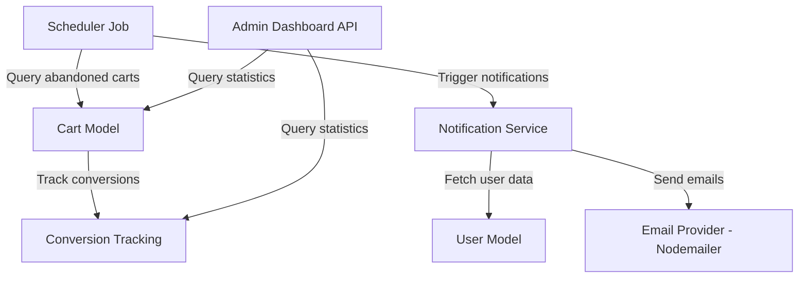

# Design Document: Abandoned Cart Notification

## Overview

The Abandoned Cart Notification feature implements an automated email reminder system for the Krishna Motor Parts ecommerce platform. When users add items to their cart but don't complete checkout, the system sends up to three reminder emails at strategic intervals (1 hour, 24 hours, 3 days) to encourage purchase completion.

The design extends the existing Cart model with abandonment tracking fields, integrates with the existing NotificationService for email delivery, and introduces a new scheduled job system using node-cron for periodic cart monitoring. The feature includes opt-out management, conversion tracking, and an admin dashboard for monitoring effectiveness.

## Architecture

### System Components



### Data Flow

1. **Cart Modification**: User adds/updates cart → Update `lastModifiedAt` timestamp
2. **Abandonment Detection**: Scheduler runs every 15 minutes → Queries carts with items, no recent activity, and notification eligibility
3. **Notification Trigger**: For each abandoned cart → Check opt-out status → Determine reminder number → Send email
4. **Email Delivery**: NotificationService → Generate HTML with cart details → Send via Nodemailer → Record sent timestamp
5. **Conversion Tracking**: User completes checkout → Check if notifications were sent → Record attribution data
6. **Statistics**: Admin queries dashboard → Aggregate abandonment and conversion data → Display metrics

## Components and Interfaces

### 1. Cart Model Extensions

Extend the existing `Cart` model with new fields:

```javascript
// New fields to add to cartSchema
{
  abandonmentTracking: {
    isAbandoned: { type: Boolean, default: false },
    abandonedAt: { type: Date },
    notificationsSent: { type: Number, default: 0 },
    lastNotificationSent: { type: Date },
    notificationTimestamps: [{ type: Date }],
    convertedAfterNotification: { type: Boolean, default: false },
    conversionTimestamp: { type: Date }
  },
  lastModifiedAt: { type: Date, default: Date.now }
}

// New indexes
cartSchema.index({ 'abandonmentTracking.isAbandoned': 1, 'abandonmentTracking.notificationsSent': 1 });
cartSchema.index({ lastModifiedAt: -1 });
```

### 2. User Model Extensions

Extend the existing `User` model with notification preferences:

```javascript
// New field to add to userSchema
{
  notificationPreferences: {
    abandonedCartEmails: { type: Boolean, default: true }
  }
}
```

### 3. Abandoned Cart Scheduler

New service: `server/src/services/abandonedCartScheduler.js`

```javascript
class AbandonedCartScheduler {
  constructor(notificationService) {
    this.notificationService = notificationService;
    this.isRunning = false;
  }
  
  start() {
    // Run every 15 minutes
    cron.schedule('*/15 * * * *', async () => {
      await this.processAbandonedCarts();
    });
  }
  
  async processAbandonedCarts() {
    // Find carts eligible for notifications
    // Send appropriate reminder based on time elapsed
    // Update cart tracking data
  }
  
  async findEligibleCarts() {
    // Query logic for finding carts needing notifications
  }
  
  async shouldSendNotification(cart) {
    // Determine if cart is eligible based on timing rules
  }
  
  determineReminderNumber(cart) {
    // Calculate which reminder to send (1, 2, or 3)
  }
}
```

### 4. Notification Service Extensions

Extend `server/src/services/notificationService.js` with new methods:

```javascript
class NotificationService {
  // ... existing methods ...
  
  async sendAbandonedCartReminder(cart, user, reminderNumber) {
    // Validate user opt-in status
    // Generate email HTML
    // Send email
    // Update cart tracking
  }
  
  generateAbandonedCartHTML(cart, user, reminderNumber) {
    // Generate mobile-responsive HTML
    // Include product details, images, prices
    // Include checkout link and unsubscribe link
    // Vary message based on reminder number
  }
}
```

### 5. Opt-Out Controller

New controller: `server/src/controllers/notificationPreferencesController.js`

```javascript
// Handle unsubscribe requests
async function unsubscribeFromAbandonedCart(req, res) {
  // Extract user ID from token/link
  // Update user preferences
  // Return confirmation
}

// Handle preference updates
async function updateNotificationPreferences(req, res) {
  // Update user notification preferences
  // Return updated preferences
}

// Get current preferences
async function getNotificationPreferences(req, res) {
  // Return user's current notification preferences
}
```

### 6. Admin Dashboard API

New controller: `server/src/controllers/adminAbandonedCartController.js`

```javascript
// Get abandoned cart statistics
async function getAbandonedCartStats(req, res) {
  // Query parameters: startDate, endDate
  // Return aggregated statistics
}

// Get detailed abandoned cart list
async function getAbandonedCarts(req, res) {
  // Query parameters: page, limit, status
  // Return paginated list of abandoned carts
}

// Get conversion metrics
async function getConversionMetrics(req, res) {
  // Return conversion rates by reminder number
  // Return revenue recovered
}
```

## Data Models

### Cart Model Schema Extensions

```javascript
const cartSchema = new mongoose.Schema({
  // ... existing fields ...
  
  abandonmentTracking: {
    isAbandoned: {
      type: Boolean,
      default: false,
      index: true
    },
    abandonedAt: {
      type: Date,
      index: true
    },
    notificationsSent: {
      type: Number,
      default: 0,
      min: 0,
      max: 3
    },
    lastNotificationSent: {
      type: Date
    },
    notificationTimestamps: [{
      type: Date
    }],
    convertedAfterNotification: {
      type: Boolean,
      default: false
    },
    conversionTimestamp: {
      type: Date
    },
    conversionReminderNumber: {
      type: Number,
      min: 1,
      max: 3
    }
  },
  
  lastModifiedAt: {
    type: Date,
    default: Date.now,
    index: true
  }
});

// Compound index for efficient abandoned cart queries
cartSchema.index({ 
  'abandonmentTracking.isAbandoned': 1, 
  'abandonmentTracking.notificationsSent': 1,
  'lastModifiedAt': -1 
});
```

### User Model Schema Extensions

```javascript
const userSchema = new mongoose.Schema({
  // ... existing fields ...
  
  notificationPreferences: {
    abandonedCartEmails: {
      type: Boolean,
      default: true
    },
    optOutDate: {
      type: Date
    }
  }
});
```

### Email Template Data Structure

```javascript
interface AbandonedCartEmailData {
  user: {
    firstName: string;
    email: string;
  };
  cart: {
    items: Array<{
      product: {
        name: string;
        partNumber: string;
        images: string[];
        price: number;
        discountPrice?: number;
      };
      quantity: number;
      subtotal: number;
    }>;
    totalAmount: number;
    totalItems: number;
  };
  reminderNumber: number; // 1, 2, or 3
  checkoutUrl: string;
  unsubscribeUrl: string;
}
```

## Correctness Properties

A property is a characteristic or behavior that should hold true across all valid executions of a system—essentially, a formal statement about what the system should do. Properties serve as the bridge between human-readable specifications and machine-verifiable correctness guarantees.


### Property 1: Cart modification updates timestamp

*For any* cart and any modification operation (add item, update quantity, remove item), performing the modification should update the lastModifiedAt timestamp to the current time.

**Validates: Requirements 1.1, 1.2**

### Property 2: Checkout prevents abandonment notifications

*For any* cart that has been marked as converted (checkout completed), the cart should be excluded from abandoned cart notification queries regardless of its age or notification count.

**Validates: Requirements 1.3**

### Property 3: Abandonment detection identifies eligible carts

*For any* cart with items present and lastModifiedAt timestamp older than 1 hour, the abandonment detection logic should mark it as abandoned.

**Validates: Requirements 1.4**

### Property 4: Abandonment data persistence

*For any* cart marked as abandoned, querying the cart from the database should return the abandonment status and timestamp correctly stored.

**Validates: Requirements 1.5**

### Property 5: Reminder timing logic

*For any* abandoned cart, the system should determine the correct reminder number (1, 2, or 3) based on time elapsed since abandonment and previous notification count: 1 hour for first reminder, 24 hours for second, 3 days for third.

**Validates: Requirements 2.2, 2.3, 2.4**

### Property 6: Maximum notification limit

*For any* cart with 3 or more notifications already sent, the cart should be excluded from further notification processing.

**Validates: Requirements 2.5**

### Property 7: Notification tracking persistence

*For any* cart, after sending a reminder email, querying the cart should show the notification count incremented by 1 and the lastNotificationSent timestamp updated to the send time.

**Validates: Requirements 2.6**

### Property 8: Email content completeness

*For any* abandoned cart with valid products, the generated reminder email HTML should contain all product names, images, quantities, prices, the total cart value, a checkout link, and an unsubscribe link.

**Validates: Requirements 3.1, 3.2, 3.3, 3.4**

### Property 9: Reminder message variation

*For any* two different reminder numbers (1, 2, or 3), the generated email message text should differ to avoid repetitive content.

**Validates: Requirements 3.6**

### Property 10: Opt-out updates user preferences

*For any* user, when the opt-out action is performed, querying the user's notification preferences should show abandonedCartEmails set to false.

**Validates: Requirements 4.1, 4.5**

### Property 11: Opted-out users excluded from notifications

*For any* user with abandonedCartEmails preference set to false, their abandoned carts should be excluded from notification processing.

**Validates: Requirements 4.2**

### Property 12: Opt-in restoration

*For any* user with abandonedCartEmails set to false, updating the preference to true should allow their carts to be eligible for notifications again.

**Validates: Requirements 4.4**

### Property 13: Conversion attribution recording

*For any* cart with at least one notification sent, when checkout is completed, the cart should be marked with convertedAfterNotification set to true and store the reminder number that preceded the conversion.

**Validates: Requirements 5.1, 5.2**

### Property 14: Conversion time tracking

*For any* cart that converts after notification, the system should calculate and store the time elapsed between the last notification sent and the conversion timestamp.

**Validates: Requirements 5.3**

### Property 15: Abandoned cart count accuracy

*For any* date range and set of carts, the abandoned cart count query should return the exact number of carts that were marked as abandoned within that date range.

**Validates: Requirements 6.1**

### Property 16: Abandonment rate calculation

*For any* set of carts, the abandonment rate should equal (number of abandoned carts / total number of carts with items) × 100.

**Validates: Requirements 6.2**

### Property 17: Recovery rate calculation

*For any* set of abandoned carts, the recovery rate should equal (number of carts converted after notification / total abandoned carts with notifications sent) × 100.

**Validates: Requirements 6.3**

### Property 18: Conversion metrics by reminder number

*For any* set of conversions, grouping by reminder number (1, 2, or 3) and calculating conversion rates should produce accurate percentages that sum to the total recovery rate.

**Validates: Requirements 6.5**

### Property 19: Revenue recovery calculation

*For any* set of carts converted after notification, the total revenue recovered should equal the sum of all cart totalAmount values where convertedAfterNotification is true.

**Validates: Requirements 6.6**

### Property 20: Date range filtering

*For any* date range filter applied to statistics queries, the results should include only data where timestamps fall within the specified start and end dates.

**Validates: Requirements 6.7**

### Property 21: Invalid product filtering

*For any* cart containing products that no longer exist or are inactive, the generated email should include only valid products and exclude invalid ones.

**Validates: Requirements 7.5**

### Property 22: Concurrent processing deduplication

*For any* cart, if multiple scheduler instances process abandoned carts simultaneously, the cart should receive at most one notification per eligible time period.

**Validates: Requirements 8.2**

## Error Handling

### Email Delivery Failures

- Implement retry logic with exponential backoff (1s, 2s, 4s delays)
- Maximum 3 retry attempts per email
- Log all failures with cart ID, user ID, error message, and timestamp
- Continue processing remaining carts even if one fails
- Store failure status in cart tracking for admin visibility

### Database Errors

- Wrap all database operations in try-catch blocks
- Log errors with context (operation type, cart ID, timestamp)
- For scheduler: log error and wait for next scheduled run
- For API endpoints: return appropriate HTTP error codes (500 for server errors)
- Use transactions for multi-step operations (conversion tracking)

### Invalid Data Handling

- Validate cart has items before sending notification
- Filter out products that no longer exist or are inactive
- Skip notification if all products are invalid
- Validate user email format before sending
- Handle missing user data gracefully (skip notification, log warning)

### Concurrency Control

- Use MongoDB's `findOneAndUpdate` with appropriate query conditions to prevent duplicate processing
- Include `notificationsSent` count in query to ensure atomic increments
- Use optimistic locking pattern: query includes expected state, update only if state matches
- Example: `{ _id: cartId, 'abandonmentTracking.notificationsSent': currentCount }`

## Testing Strategy

### Unit Testing

Unit tests should focus on specific examples, edge cases, and error conditions:

- Specific cart scenarios (empty cart, single item, multiple items)
- Edge cases (cart with only invalid products, user without email)
- Error conditions (email send failure, database unavailable)
- Boundary conditions (exactly 1 hour, exactly 24 hours, exactly 3 days)
- Opt-out flow (unsubscribe, re-subscribe)
- Date range filtering edge cases (same start/end date, invalid ranges)

### Property-Based Testing

Property tests verify universal properties across all inputs using randomized test data. Each property test should:

- Run minimum 100 iterations with randomized inputs
- Reference the corresponding design property number
- Use tag format: **Feature: abandoned-cart-notification, Property {N}: {property_text}**

Property tests should cover:

- Cart modification timestamp updates (Property 1)
- Abandonment detection logic (Property 3)
- Reminder timing calculations (Property 5)
- Notification count limits (Property 6)
- Email content generation (Property 8)
- Opt-out filtering (Property 11)
- Conversion attribution (Property 13)
- Statistics calculations (Properties 16, 17, 19)
- Invalid product filtering (Property 21)

### Testing Library

Use **fast-check** for property-based testing in Node.js. Configure each test to run minimum 100 iterations.

Example test structure:
```javascript
const fc = require('fast-check');

describe('Feature: abandoned-cart-notification, Property 1: Cart modification updates timestamp', () => {
  it('should update lastModifiedAt for any cart modification', async () => {
    await fc.assert(
      fc.asyncProperty(
        fc.record({
          userId: fc.string(),
          items: fc.array(fc.record({
            productId: fc.string(),
            quantity: fc.integer({ min: 1, max: 100 })
          }))
        }),
        async (cartData) => {
          // Test implementation
        }
      ),
      { numRuns: 100 }
    );
  });
});
```

### Integration Testing

- Test complete flow: cart creation → abandonment → notification → conversion
- Test scheduler integration with notification service
- Test email delivery through Nodemailer
- Test admin dashboard API endpoints with real database queries
- Test opt-out flow from email link to database update

### Test Environment

- Use MongoDB in-memory server for isolated testing
- Mock Nodemailer for email testing (capture emails without sending)
- Mock time/date functions for testing time-based logic
- Seed test database with realistic cart and user data

## Implementation Notes

### Scheduler Implementation

Use `node-cron` for scheduling (add as dependency):
```bash
npm install node-cron
```

Initialize scheduler in `server.js` after database connection:
```javascript
const abandonedCartScheduler = require('./services/abandonedCartScheduler');
abandonedCartScheduler.start();
```

### Email Template Styling

Reuse existing email template structure from NotificationService:
- Inline CSS for email client compatibility
- Mobile-responsive design (max-width: 600px)
- Product images with fallback alt text
- Clear call-to-action buttons
- Professional color scheme matching brand

### Unsubscribe Link Format

Generate signed tokens for unsubscribe links to prevent tampering:
```
https://krishnamotorparts.com/unsubscribe/abandoned-cart?token={signed_user_id}
```

Use JWT or similar signing mechanism to validate tokens.

### Performance Considerations

- Index fields used in scheduler queries: `lastModifiedAt`, `abandonmentTracking.isAbandoned`, `abandonmentTracking.notificationsSent`
- Process carts in batches of 50 to limit memory usage
- Use lean queries when only reading data (no Mongoose document overhead)
- Cache product data during email generation to reduce database queries

### Monitoring and Logging

- Log scheduler runs (start time, carts processed, emails sent, errors)
- Log email send attempts and results
- Log opt-out actions
- Log conversion attributions
- Use structured logging format for easy parsing and analysis
