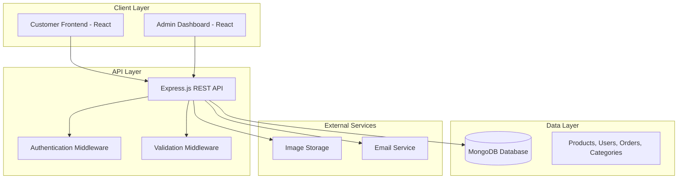

# Design Document: Automobile Ecommerce Platform

## Overview

The automobile ecommerce platform is a full-stack MERN application that enables Krishna Motor Parts to sell spare parts online. The system consists of a React frontend for customer and admin interfaces, a Node.js/Express backend API, and a MongoDB database for data persistence.

The architecture follows a three-tier pattern with clear separation between presentation (React), business logic (Express API), and data storage (MongoDB). The system supports both customer-facing ecommerce functionality and admin management capabilities.

## Architecture



## Components and Interfaces

### Frontend Components

**Customer Interface (React)**
- **ProductCatalog**: Displays products with filtering and search
- **ProductDetail**: Shows individual product information and related items
- **ShoppingCart**: Manages cart items and quantities
- **Checkout**: Handles order placement and delivery information
- **UserProfile**: Manages customer account and order history
- **SearchBar**: Provides product search functionality

**Admin Interface (React)**
- **AdminDashboard**: Overview of orders, inventory, and analytics
- **ProductManagement**: CRUD operations for products
- **OrderManagement**: View and update order statuses
- **InventoryTracker**: Monitor stock levels and alerts
- **CustomerData**: View customer information and order history

### Backend API Structure

**Authentication & Authorization**
```javascript
// Middleware structure
app.use('/api/admin/*', authenticateAdmin);
app.use('/api/user/*', authenticateUser);
app.use('/api/public/*', rateLimiter);
```

**API Endpoints**
- **Products API**: `/api/products` - CRUD operations, search, filtering
- **Users API**: `/api/users` - Registration, login, profile management
- **Orders API**: `/api/orders` - Order creation, tracking, management
- **Cart API**: `/api/cart` - Cart operations for logged-in users
- **Admin API**: `/api/admin` - Admin-specific operations
- **Categories API**: `/api/categories` - Product categorization

### Middleware Components

**Authentication Middleware**
- JWT token validation for protected routes
- Role-based access control (customer vs admin)
- Session management and token refresh

**Validation Middleware**
- Request body validation using Joi or express-validator
- File upload validation for product images
- Input sanitization for security

**Error Handling Middleware**
- Centralized error processing
- Consistent error response format
- Logging and monitoring integration

## Data Models

### MongoDB Schema Design

**Product Schema**
```javascript
{
  _id: ObjectId,
  name: String,
  description: String,
  category: ObjectId, // Reference to Category
  subcategory: String,
  price: Number,
  discountPrice: Number,
  brand: String,
  partNumber: String,
  compatibility: [{
    make: String,
    model: String,
    year: Number
  }],
  specifications: Map,
  images: [String], // URLs to image files
  stock: {
    quantity: Number,
    lowStockThreshold: Number,
    inStock: Boolean
  },
  tags: [String],
  createdAt: Date,
  updatedAt: Date,
  isActive: Boolean
}
```

**User Schema**
```javascript
{
  _id: ObjectId,
  email: String,
  password: String, // Hashed with bcrypt
  firstName: String,
  lastName: String,
  phone: String,
  role: String, // 'customer' or 'admin'
  addresses: [{
    type: String, // 'home', 'work', etc.
    street: String,
    city: String,
    state: String,
    pincode: String,
    isDefault: Boolean
  }],
  createdAt: Date,
  lastLogin: Date,
  isActive: Boolean
}
```

**Order Schema**
```javascript
{
  _id: ObjectId,
  orderNumber: String,
  customerId: ObjectId, // Reference to User
  items: [{
    productId: ObjectId, // Reference to Product
    name: String, // Denormalized for order history
    price: Number,
    quantity: Number,
    subtotal: Number
  }],
  totalAmount: Number,
  shippingAddress: {
    street: String,
    city: String,
    state: String,
    pincode: String,
    phone: String
  },
  paymentMethod: String, // 'cod', 'razorpay', 'stripe'
  paymentStatus: String, // 'pending', 'paid', 'failed'
  orderStatus: String, // 'placed', 'processing', 'shipped', 'delivered', 'cancelled'
  createdAt: Date,
  updatedAt: Date,
  deliveryDate: Date
}
```

**Category Schema**
```javascript
{
  _id: ObjectId,
  name: String,
  description: String,
  parentCategory: ObjectId, // For hierarchical categories
  image: String,
  isActive: Boolean,
  sortOrder: Number
}
```

**Cart Schema** (for persistent carts)
```javascript
{
  _id: ObjectId,
  userId: ObjectId, // Reference to User
  items: [{
    productId: ObjectId,
    quantity: Number,
    addedAt: Date
  }],
  updatedAt: Date
}
```

### Database Indexing Strategy

**Performance Indexes**
- Products: Compound index on `{category: 1, price: 1, inStock: 1}`
- Products: Text index on `{name: "text", description: "text", tags: "text"}`
- Orders: Index on `{customerId: 1, createdAt: -1}`
- Users: Unique index on `{email: 1}`

## Correctness Properties

*A property is a characteristic or behavior that should hold true across all valid executions of a system-essentially, a formal statement about what the system should do. Properties serve as the bridge between human-readable specifications and machine-verifiable correctness guarantees.*

Based on the prework analysis, I'll consolidate redundant properties and create comprehensive correctness properties:

### Property Reflection

After reviewing all testable criteria, I identified several areas of redundancy:
- Price filtering appears in both requirements 1.3 and 7.3 (consolidate into one property)
- Product display requirements (1.5, 4.1, 4.4) can be combined into comprehensive display validation
- Search functionality (1.2, 7.1) overlap and can be unified
- Cart operations (2.1, 2.2) can be combined into comprehensive cart management
- Admin CRUD operations (5.1, 5.2, 5.3) can be unified into product management properties

### Core Properties

**Property 1: Product Search Completeness**
*For any* search query, all returned products should contain the search term in their name, description, or tags, and results should be properly ranked by relevance.
**Validates: Requirements 1.2, 7.1**

**Property 2: Price Range Filtering Accuracy**
*For any* price range filter with minimum and maximum values, all returned products should have prices within the specified bounds (inclusive).
**Validates: Requirements 1.3, 7.3**

**Property 3: Vehicle Compatibility Filtering**
*For any* vehicle filter (make, model, year), all returned products should include that exact vehicle specification in their compatibility array.
**Validates: Requirements 1.4, 7.2**

**Property 4: Product Display Completeness**
*For any* product being displayed, the rendered output should include name, price, description, compatibility information, stock status, images, and technical specifications.
**Validates: Requirements 1.5, 4.1, 4.4**

**Property 5: Cart Operation Consistency**
*For any* valid product and cart state, adding the product should increase cart size by one and include that product, while quantity modifications and removals should correctly update cart contents.
**Validates: Requirements 2.1, 2.2**

**Property 6: Checkout Data Validation**
*For any* checkout attempt, the system should require and validate delivery address, contact information, and payment method before allowing order completion.
**Validates: Requirements 2.3**

**Property 7: Order Generation Completeness**
*For any* successful checkout, the system should generate a unique order with all cart items, customer information, and send appropriate notifications.
**Validates: Requirements 2.5**

**Property 8: Profile Management Consistency**
*For any* valid profile data, creation and update operations should persist correctly and be retrievable in subsequent requests.
**Validates: Requirements 3.1, 3.4**

**Property 9: Address Persistence and Reusability**
*For any* saved customer address, it should be retrievable for future orders and usable in checkout processes.
**Validates: Requirements 3.3**

**Property 10: Order History Completeness**
*For any* authenticated customer, their order history should include all orders they have placed with complete tracking information.
**Validates: Requirements 3.2, 3.5**

**Property 11: Related Product Relevance**
*For any* product view, related products should share category, compatibility, or brand attributes with the viewed product.
**Validates: Requirements 4.2**

**Property 12: Admin Product Management Authority**
*For any* valid product data, admin users should be able to create, update, and manage stock status, with changes immediately reflected in the system.
**Validates: Requirements 5.1, 5.2, 5.3, 5.4**

**Property 13: Admin Order Management Completeness**
*For any* order in the system, admin users should be able to view complete order details, customer information, and update order status with automatic customer notifications.
**Validates: Requirements 6.1, 6.2, 6.3, 6.5**

**Property 14: Category and Brand Filtering Accuracy**
*For any* category or brand filter, all returned products should belong to the specified category or brand.
**Validates: Requirements 7.4**

**Property 15: Search Result Sorting Correctness**
*For any* search results with sorting applied, products should be ordered correctly by the specified criteria (price ascending/descending, popularity, or date).
**Validates: Requirements 7.5**

**Property 16: Data Persistence Integrity**
*For any* data operation (create, update, delete), the database should maintain referential integrity and include all required fields for the entity type.
**Validates: Requirements 8.1, 8.2**

**Property 17: API CRUD Operation Completeness**
*For any* entity type (products, users, orders), the API should provide complete CRUD operations with proper validation and error handling.
**Validates: Requirements 8.3, 8.5**

**Property 18: Authentication and Session Management**
*For any* authentication request, the system should properly validate credentials, manage sessions, and enforce role-based access control.
**Validates: Requirements 8.4**

<function_calls>
<invoke name="prework">
<parameter name="featureName">automobile-ecommerce-platform

## Error Handling

### API Error Responses
All API endpoints follow consistent error response format:
```javascript
{
  success: false,
  error: {
    code: "ERROR_CODE",
    message: "Human readable message",
    details: {} // Additional context when needed
  }
}
```

### Error Categories
- **Validation Errors** (400): Invalid input data, missing required fields
- **Authentication Errors** (401): Invalid credentials, expired tokens
- **Authorization Errors** (403): Insufficient permissions for requested action
- **Not Found Errors** (404): Requested resource doesn't exist
- **Conflict Errors** (409): Duplicate data, stock unavailable
- **Server Errors** (500): Database connection issues, unexpected failures

### Frontend Error Handling
- Global error boundary for React components
- Toast notifications for user-facing errors
- Retry mechanisms for network failures
- Graceful degradation when services are unavailable

### Database Error Handling
- Connection pooling and retry logic
- Transaction rollback on failures
- Data validation at schema level
- Backup and recovery procedures

## Testing Strategy

### Dual Testing Approach
The system requires both unit testing and property-based testing for comprehensive coverage:

**Unit Tests**: Verify specific examples, edge cases, and error conditions
- Authentication flows with valid/invalid credentials
- Cart operations with empty carts and maximum quantities
- Product filtering with edge cases (empty results, invalid filters)
- Order processing with various payment methods
- Admin operations with different user roles

**Property Tests**: Verify universal properties across all inputs
- Each correctness property will be implemented as a property-based test
- Minimum 100 iterations per property test to ensure thorough coverage
- Tests will use generated data to cover wide input ranges

### Property-Based Testing Configuration
- **Framework**: Use `fast-check` for JavaScript property-based testing
- **Test Tagging**: Each property test tagged with format: **Feature: automobile-ecommerce-platform, Property {number}: {property_text}**
- **Iteration Count**: Minimum 100 iterations per property test
- **Data Generation**: Smart generators for products, users, orders, and cart states

### Testing Tools and Setup
- **Unit Testing**: Jest with React Testing Library for frontend, Supertest for API
- **Property Testing**: fast-check for property-based test generation
- **Database Testing**: MongoDB Memory Server for isolated test environments
- **Integration Testing**: Full API testing with test database
- **E2E Testing**: Cypress for critical user flows (optional for MVP)

### Test Coverage Requirements
- Minimum 80% code coverage for business logic
- All API endpoints must have integration tests
- All correctness properties must have corresponding property tests
- Critical user flows must have end-to-end test coverage

## File Structure

### Backend Structure
```
server/
├── src/
│   ├── controllers/          # Route handlers
│   │   ├── authController.js
│   │   ├── productController.js
│   │   ├── orderController.js
│   │   └── adminController.js
│   ├── middleware/           # Custom middleware
│   │   ├── auth.js
│   │   ├── validation.js
│   │   └── errorHandler.js
│   ├── models/              # MongoDB schemas
│   │   ├── Product.js
│   │   ├── User.js
│   │   ├── Order.js
│   │   └── Category.js
│   ├── routes/              # API routes
│   │   ├── auth.js
│   │   ├── products.js
│   │   ├── orders.js
│   │   └── admin.js
│   ├── services/            # Business logic
│   │   ├── productService.js
│   │   ├── orderService.js
│   │   └── emailService.js
│   ├── utils/               # Helper functions
│   │   ├── database.js
│   │   ├── jwt.js
│   │   └── validators.js
│   └── app.js               # Express app setup
├── tests/                   # Test files
│   ├── unit/
│   ├── integration/
│   └── properties/
├── package.json
└── server.js                # Entry point
```

### Frontend Structure
```
client/src/
├── components/              # Reusable components
│   ├── common/
│   │   ├── Header.jsx
│   │   ├── Footer.jsx
│   │   └── LoadingSpinner.jsx
│   ├── product/
│   │   ├── ProductCard.jsx
│   │   ├── ProductList.jsx
│   │   └── ProductDetail.jsx
│   └── cart/
│       ├── CartItem.jsx
│       └── CartSummary.jsx
├── pages/                   # Page components
│   ├── Home.jsx
│   ├── ProductCatalog.jsx
│   ├── ProductDetail.jsx
│   ├── Cart.jsx
│   ├── Checkout.jsx
│   ├── Profile.jsx
│   └── admin/
│       ├── Dashboard.jsx
│       ├── ProductManagement.jsx
│       └── OrderManagement.jsx
├── hooks/                   # Custom React hooks
│   ├── useAuth.js
│   ├── useCart.js
│   └── useProducts.js
├── services/                # API calls
│   ├── api.js
│   ├── authService.js
│   ├── productService.js
│   └── orderService.js
├── context/                 # React context
│   ├── AuthContext.js
│   └── CartContext.js
├── utils/                   # Helper functions
│   ├── formatters.js
│   └── validators.js
└── App.jsx                  # Main app component
```

### Database Collections Structure
```
MongoDB Collections:
├── products                 # Product catalog
├── users                   # Customer and admin accounts
├── orders                  # Order transactions
├── categories              # Product categories
├── carts                   # Persistent shopping carts
└── sessions                # User sessions (if not using JWT)
```

This design provides a solid foundation for your automobile ecommerce platform with clear separation of concerns, comprehensive error handling, and robust testing strategies. The MERN stack architecture ensures scalability while the property-based testing approach guarantees correctness across all system operations.